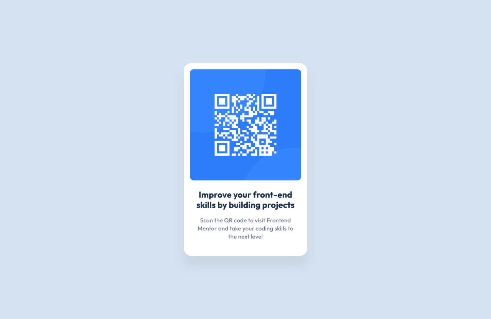

# Frontend Mentor - QR code component solution

This is a solution to the [QR code component challenge on Frontend Mentor](https://www.frontendmentor.io/challenges/qr-code-component-iux_sIO_H). 

## Table of contents

- [Overview](#overview)
  - [Screenshot](#screenshot)
  - [Links](#links)
- [My process](#my-process)
  - [Built with](#built-with)
- [Author](#author)

## Overview

### Screenshot

### Links

- Solution URL: [https://github.com/hello-ana/qr-code-component](https://github.com/hello-ana/qr-code-component)
- Live Site URL: [https://hello-ana.github.io/qr-code-component/](https://hello-ana.github.io/qr-code-component/)

## My process

### Built with

- Semantic HTML5 markup
- CSS custom properties
- Flexbox

## Author

- Website - [hello-ana.com](https://hello-ana.com)
- Frontend Mentor - [@hello-ana](https://www.frontendmentor.io/profile/hello-ana)
- Twitter - [@hello_ana_web](https://x.com/hello_ana_web)
